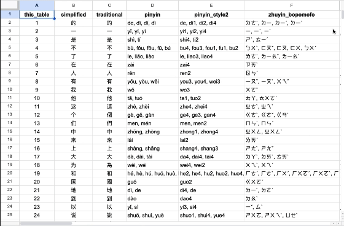

# zhongwen
大家好～
Curating a collection of Mandarin Chinese vocabulary, idioms (成语), and characters (汉字). Utilizing data from HSK 3.0, RSH, and other frequency lists. Providing information such as meanings, pinyin pronunciation, character decomposition, frequency order, and relevant tags.

| csv file name      | words | characters （汉字）   | total    |
| :---        |    :----:   |       :----: | ---:     |
| hsk 3.0  - characters.csv |       | x  | 11,092    |
| hsk 3.0  - words.csv| x       |       | 3,000    |
| rsh.csv   |         | x      | 3,000   |
| chengyu_by_theme.csv   |        |      | 2,350   |
| mega_hanzi_compilation.csv   |         |   x    | 11,266    |

### Table of Contents
[HSK 3.0 (11,092 words and 3,000 characters) ](#hsk-30-汉语水平考试-chinese-proficiency-test)  
[Remembering Simplified Hanzi - RSH (3,000 characters)](#remembering-simplified-hanzi-rsh)  
[Chengyu 成语 - Chinese Idioms ordered by theme](#chengyu-成语)  
[General Standard Chinese Characters 通用规范汉字表 (8,105 characters)](#general-standard-chinese-characters-通用规范汉字表)  
[Jun Da's Character frequency list of Modern Chinese List (9,933 characters)](#jun-das-modern-chinese-character-frequency-list)   
[Character frequency list compilation of 11,266 characters ](#compilation-of-11266-hanzi)  
[Additional Language Learning Resources](#additional-language-learning-resources)  

## HSK 3.0 汉语水平考试 (Chinese Proficiency Test)
>People's Republic of China's standardized test of proficiency in PRC Standard Chinese for non-native speakers.

Both list, includes characters, pinyin, and definitions
* Characters (recognition) - 3,000
* Words - 11,092

## Remembering Simplified Hanzi (RSH)
3,000 characters

Book 1 and 2.
>By James W. Heisig, Timothy W.Richardson. Book 1 of Remembering Simplified Hanzi covers the writing and meaning of the 1,000 most commonly used characters in the simplified Chinese writing system, plus another 500 that are best learned at an early stage. (Book 2 adds another 1,500 characters for a total of 3,000.)

## Chengyu 成语
>Chengyu are a type of traditional Chinese idiomatic expressions, most of which consist of four characters.

Data source : [中国成语大全，值得收藏！(Chengyu)](https://mp.weixin.qq.com/s?__biz=MzA4OTQ1OTgwNQ==&mid=402870742&idx=7&sn=567e8062d5c1cfb4fe8bdde16c60c283&scene=27)

## Jun Da's Modern Chinese Character Frequency List
>This website provides character frequency lists generated from a large corpus of Chinese texts collected from online sources. 

https://lingua.mtsu.edu/chinese-computing/statistics/

## General Standard Chinese Characters 通用规范汉字表
>The Table of General Standard Chinese Characters is the current standard list of 8,105 Chinese characters published by the government of the People's Republic of China and promulgated in June 2013.

## Compilation of 11,266 Hanzi
Used the following sources:
#### Lists
* [HSK 3.0 Documentation](https://old.chinesetest.cn/standardsAction.do?means=standardInfo)
* [Mandarin Chinese: New HSK 3.0 Vocabulary and Characters](https://ankiweb.net/shared/info/1144807196)
* [Jun Da's Character Frequency List](https://lingua.mtsu.edu/chinese-computing/statistics/)
* [Table of General Standard Chinese Characters 通用规范汉字表](https://github.com/rime-aca/character_set/blob/master/%E9%80%9A%E7%94%A8%E8%A6%8F%E7%AF%84%E6%BC%A2%E5%AD%97%E8%A1%A8.txt)

* [中国成语大全，值得收藏！(Chengyu)](https://mp.weixin.qq.com/s?__biz=MzA4OTQ1OTgwNQ==&mid=402870742&idx=7&sn=567e8062d5c1cfb4fe8bdde16c60c283&scene=27)
* [Chinese Character Map (CCM)](https://learnm.org/about)

#### Dictionaries
* [Pleco dictionary](https://www.pleco.com/)
* [CC-CEDICT](https://www.mdbg.net/chinese/dictionary?page=cedict)
* [Chinese Dictionary](https://www.zdic.net)

#### Parser/Module/Libraries 
* [CC-CEDICT parser](https://github.com/rubber-duck-dragon/rubber-duck-dragon.github.io/blob/master/cc-cedict_parser/parser.py)
* [Pinyin Parser (Python/pip)](https://pypi.org/project/pypinyin/), [Github](https://github.com/mozillazg/python-pinyin)
* [Chinese Character Module - Character decomposition (npm)](https://www.npmjs.com/package/hanzi), [Github](https://github.com/nieldlr/Hanzi)
* [Cantonese Module (Python/pip)](https://pycantonese.org/quickstart.html)

##  Additional Language Learning Resources
* [Notion List of Mandarin Chinese Resources](https://www.notion.so/alyssabedard/Languages-5e39572cb5314ff3baf57f6932a1010d?pvs=4)

